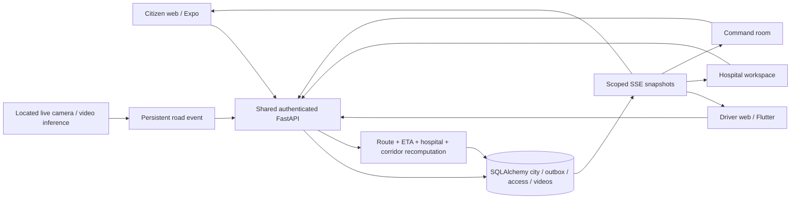

# Connected AEGIS architecture

One incident ID links the citizen request, assignment, driver GPS, hospital reservation, route, corridor and road evidence. The authoritative runtime is FastAPI with the existing SQLAlchemy database. React interfaces never advance a mission locally.

The command room embeds the existing synchronized vision canvas, transcript, snapshots and printable report. Source-clock inference and bounded latest-frame buffers remain intact. A registered camera supplies geographic coordinates; pixels do not establish geographic location. Significant temporal findings enter the same transaction service as operator road findings. Duplicate camera findings are deduplicated by session, segment and event ID.

Capability, crew, readiness, shift, location freshness, available capacity, workload and traffic-adjusted ETA determine ambulance eligibility. Assignment delivery/receipt and acceptance remain different facts; a 60-second acceptance deadline triggers reassignment. Pickup starts hospital ranking by capability, capacity and travel time. Hospital acceptance activates critical-patient corridors. Lost capacity diverts and requires new hospital acceptance. Corridor signals release after handover.

Routes use the explicitly marked DEMO_GRAPH provider: geographic candidate paths and event intersections, not a street-network navigation service. Signals simulate controller state. Optional Google Maps displays the same geographic state; it does not supply real traffic or route calculations. External admission/identity, street routing, ambulance operations and physical controller providers remain deployment work. No clinical diagnosis is generated; severity is confirmed by an EMT.

Legacy Spring Boot, Express and Cloudflare servers remain available as preserved branch source, but are not started in the connected runtime. Their independent stores must not run alongside the shared incident authority. Native compatibility projections call the same service, not another simulated store.
